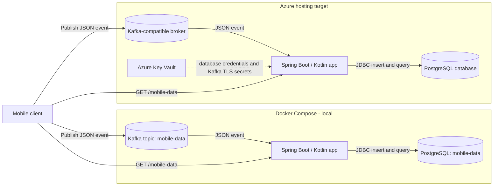

# Mobile Data Service

A Kotlin and Spring Boot service that consumes mobile JSON events from Kafka, stores them in PostgreSQL, and exposes the stored payloads over HTTP. Docker Compose provides the local stack. The application also has a cloud profile for an Azure-hosted deployment using externally configured database and Kafka TLS settings.

## Architecture



Flyway creates the `mobile_events` table and its index at application startup. The Kafka consumer stores each valid JSON message in the `payload` JSONB column with a generated ID and receive timestamp. `GET /mobile-data` returns the stored payloads, newest first.

## Run Locally

Prerequisites: Docker Desktop and a Java 17-compatible JDK.

Copy the local environment template and start the stack:

```powershell
Copy-Item .env.example .env
./gradlew bootJar
docker compose up --build
```

On macOS/Linux (bash or zsh):

```bash
cp .env.example .env
./gradlew bootJar
docker compose up --build
```

Compose starts PostgreSQL and Kafka first and waits for both health checks before starting the app. The app listens at `http://localhost:8080`; if that host port is busy, start with another port:

```powershell
$env:APP_PORT = "8081"
docker compose up --build
```

On macOS/Linux (bash or zsh):

```bash
APP_PORT=8081 docker compose up --build
```

The mobile-data endpoint is `GET http://localhost:8080/mobile-data` (use `8081` if you changed `APP_PORT`). To send a sample event from PowerShell:

```powershell
'{"deviceId":"device-1","value":42}' | docker compose exec -T kafka /opt/kafka/bin/kafka-console-producer.sh --bootstrap-server kafka:29092 --topic mobile-data
Invoke-RestMethod http://localhost:8080/mobile-data
```

On macOS/Linux (bash or zsh):

```bash
printf '%s\n' '{"deviceId":"device-1","value":42}' | docker compose exec -T kafka /opt/kafka/bin/kafka-console-producer.sh --bootstrap-server kafka:29092 --topic mobile-data
curl http://localhost:8080/mobile-data
```

For pgAdmin or another database client on the host, connect to `localhost:5432`, database `mobile-data`, username `hellokube`, and the `POSTGRES_PASSWORD` value from `.env`. The sample password in `.env.example` is for local development only. PostgreSQL data is persisted in a Docker volume.

## Azure

The `cloud` Spring profile accepts database settings through environment variables and configures Kafka TLS using mounted keystore/truststore files and secret-sourced passwords. Supply these from Azure Key Vault and the chosen Azure hosting platform; do not commit production secrets.

Azure hosting is a target, not yet a complete deployment in this repository. The Terraform currently creates an Azure resource group; it does not provision the application platform, Kafka, or PostgreSQL. The Kubernetes manifests and additional run notes are maintained separately.

## Kubernetes Training

Kubernetes training material can be found [here](kubeneters.md).
